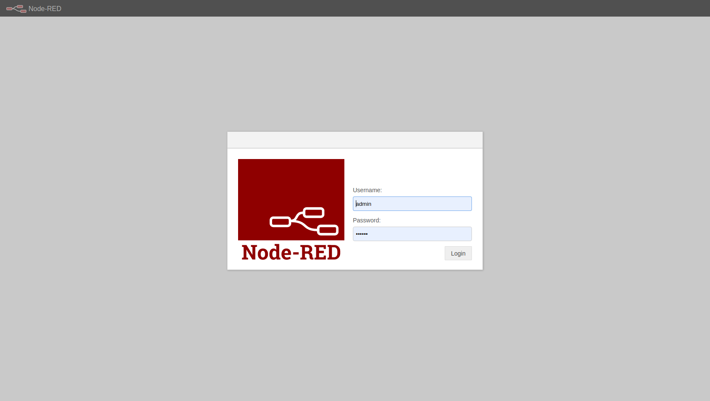

# ioit-uniovi-docker-nodered
IoT Node-RED Docker Service Uniovi PoC

## Securize node-red
To securize node-red we must create passwords compatible with node-RED and we must to the node-RED Admin command line. for more details visit this link [node-RED Admin CLI](https://nodered.org/docs/user-guide/node-red-admin). To install we must execute this command:
 
```shell
npm install -g --unsafe-perm node-red-admin
```

No execute this command to create a new node-RED password compatible:
```shell
node-red-admin hash-pw
```

## update node-RED settings
Any node-RED configuration is set under settings.js file, so any configuration that you want configure open this file ans set the correct updates

## Create and start service
```shell
docker-compose up -d
```

## Stop service
```shell
docker-compose stop
```

## Restart service
```shell
docker-compose start
```

## Remove service resources
```shell
docker-compose down
```

## Get service logs
```shell
docker-compose logs
```

## node-RED UI
Use this uri to load node-RED UI:

The default credentials are: admin/uniovi

```shell
http://localhost:1880/
```

node-RED Login


node-RED Dashboard

